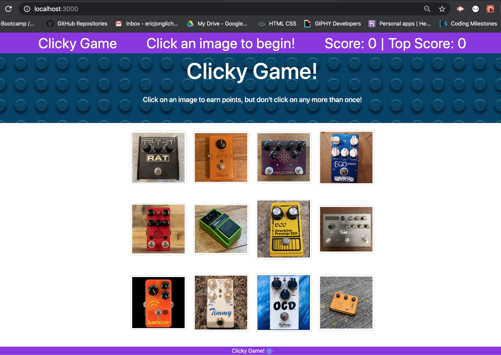

# Clicky Game

## Overview

This app is a clicking game developed with React. User gets score if previously un-clicked picture is clicked. If the user clicks the picture that already clicked before, game resets current score to 0 but top score remains the same. When the top score record is broken, the top score will be updated together with score. After achieving the maximum top score of 12, game will be reset after the following click. Then the new game starts. Incorrect clicking will cause the pictures shaken. Each click will cause shuffling the pictures.

Figure 1. Initial loading screen of the app
## Technologies used

HTML5, CSS, JavacSript, React, JSX and npm packages

## Current development

- Created React app
- Installed npm packages
- Created GitHub repository
- Tested initial deployment to GitHub
- Static front-end tested
- Transition to dynamic front-end
- Components
- Click handling
- JavaScript logics
- Rendering pictures
- Shuffling and shacking pictures
- Deployed to GitHub

## [Run the App](https://ericjchoi.github.io/clicky-game/)
